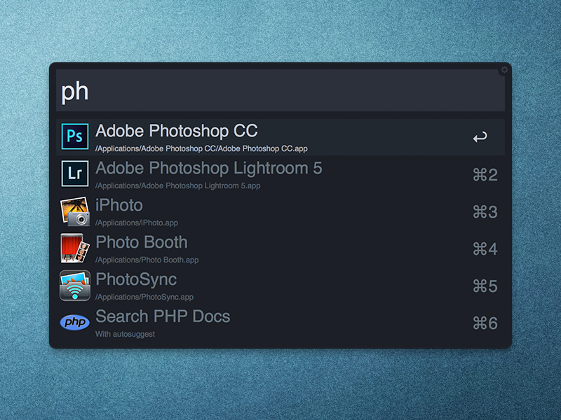
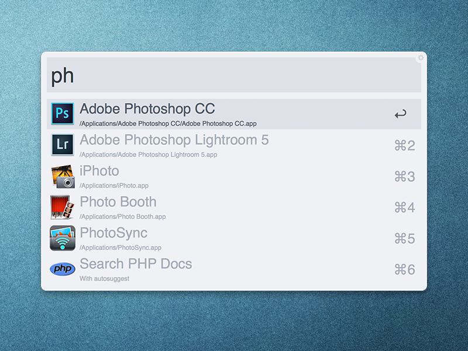

# Spacegray Alfred Themes

Inspired by the lovely Sublime Text [Spacegray theme](https://github.com/kkga/spacegray) by kkga, and another [Alfred theme](http://dribbble.com/shots/1357911-Spacegray-Alfred-v2-Theme) by Indrashish Ghosh. Thanks for the inspiration guys. Hope you enjoy my adaptation.




# Installation:

Download [the Dark appearance file](https://raw.github.com/benjamindauer/Spacegray-Alfred-Themes/master/Spacegray%20Dark.alfredappearance) by right-clicking on it, and once it downloads, double-click on the file in Finder to install it.

or

Download [the Light appearance file](https://raw.github.com/benjamindauer/Spacegray-Alfred-Themes/master/Spacegray%20Light.alfredappearance) by right-clicking on it, and once it downloads, double-click on the file in Finder to install it.

Alternatively, you can execute following commands in Terminal:

```
curl -O https://raw.github.com/benjamindauer/Spacegray-Alfred-Themes/master/Spacegray%20Dark.alfredappearance
```

or

```
curl -O https://raw.github.com/benjamindauer/Spacegray-Alfred-Themes/master/Spacegray%20Light.alfredappearance
```